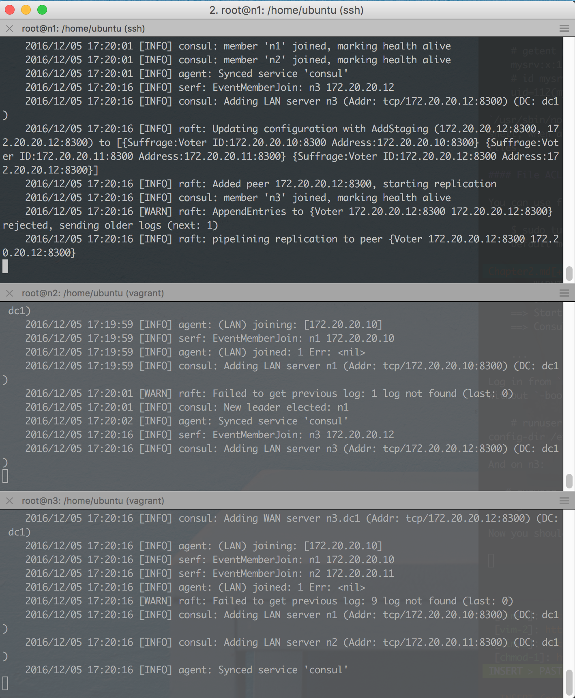
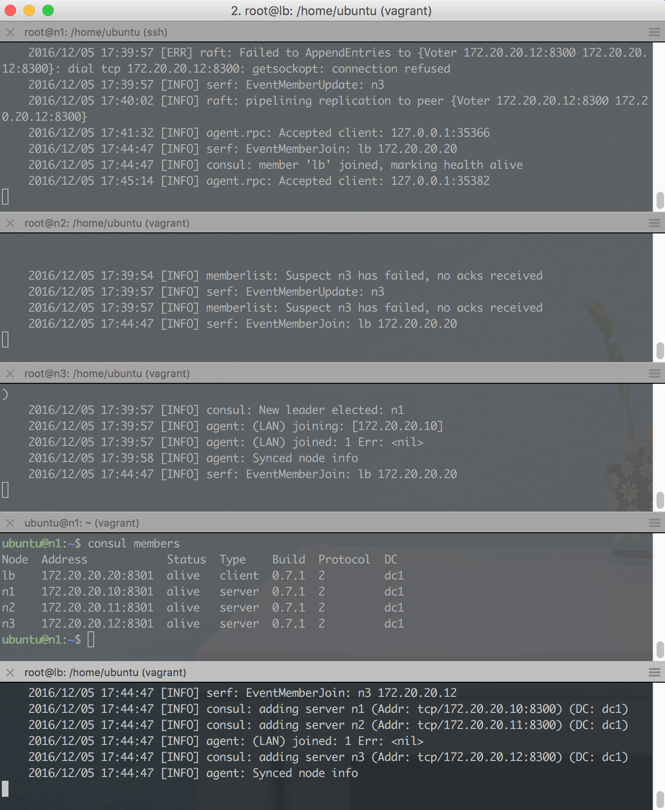

## Chapter 3 – Setting of service discovery

 - Setting up Consul as a cluster
 - Packaging Consul
 - Installing Consul from a package
 - Boostrapping Consul from package

 - Reading configuration from consul with Fakta
 - Firewalling our service
 - Setting up Consul in Kubernetes
 - The F# forge – create a new F# project

Now that we know a bit more about how to work with files, where to place
configuration and databases, we'll try our hand at setting up a Consul cluster
manually. By doing so, we'll learn more about how to operate non-trivial
networked software and how to debug its setup. Consul, together with
[Fakta][fakta-gh] gives us the foundations for service discovery and external
(side-cart) health checks for our own networked services. It also lets us play
with DNS (over UDP) and TCP and work more with socket bindings.

The steps we're going to take are as follows:

 1. Spawning four nodes
   - 3 for our consul/mysrv cluster
   - 1 nginx load balancer
 1. Set up consul on a single node
 1. Validate setup on a single node
 1. Set up consul server on the three nodes
 1. Validate setup on three nodes
 1. Set up consul client on the fourth node; the load balancer
 1. Validate setup on the load balancer
 1. Set up mysrv on the three nodes with systemd
 1. (homework) Set up load balancing to the three nodes
 1. (homework) Validate load balancing with health checks is working

### Spawning four nodes

In this repository there's a directory called *chapter-03*. Destroy your current
VM and start vagrant from there.

    ✗ cd chapter-03
    ✗ vagrant up
    Bringing machine 'n1' up with 'virtualbox' provider...
    Bringing machine 'n2' up with 'virtualbox' provider...
    Bringing machine 'n3' up with 'virtualbox' provider...
    Bringing machine 'lb' up with 'virtualbox' provider...
    ==> n1: Importing base box 'ubuntu/xenial64'...
    ==> n1: Matching MAC address for NAT networking...
    ...

    ✗ vagrant status
    Current machine states:

    n1                        running (virtualbox)
    n2                        running (virtualbox)
    n3                        running (virtualbox)
    lb                        running (virtualbox)

### Run consul on a single node

    ✗ vagrant ssh n1
    $ consul agent -dev
    ==> Starting Consul agent...
    ==> Starting Consul agent RPC...
    ==> Consul agent running!
               Version: 'v0.7.1'
             Node name: 'n1'
            Datacenter: 'dc1'
                Server: true (bootstrap: false)
           Client Addr: 127.0.0.1 (HTTP: 8500, HTTPS: -1, DNS: 8600, RPC: 8400)
          Cluster Addr: 127.0.0.1 (LAN: 8301, WAN: 8302)
        Gossip encrypt: false, RPC-TLS: false, TLS-Incoming: false
                 Atlas: <disabled>

    ==> Log data will now stream in as it occurs:
    ...

Seems to be working! Consul magically exists, because of a so called
*provisioning* script in the Vagrantfile that downloads and copies the `consul`
binary to /usr/bin/.

Let's SSH to validate that consul is up and running.

    ✗ vagrant ssh n1
    $ curl http://127.0.0.1:8500/ -i
    HTTP/1.1 301 Moved Permanently
    Location: /ui/
    Date: Mon, 05 Dec 2016 16:53:30 GMT
    Content-Length: 39
    Content-Type: text/html; charset=utf-8

    <a href="/ui/">Moved Permanently</a>.

Looking good. Now, let's cluster it!

### Clustering consul

Consul nodes can work both as server nodes and client nodes. The server nodes
should be an uneven number of nodes larger than three, with mutual connectivity.
The rest of your computers can run consul in client mode: aim for a ratio of,
say, 1:10 of server-to-client nodes.

We'll start by pinging `n2` and `n3` from `n1`, to verify connectivity.

    ubuntu@n1:~$ ping 172.20.20.11
    PING 172.20.20.11 (172.20.20.11) 56(84) bytes of data.
    64 bytes from 172.20.20.11: icmp_seq=1 ttl=64 time=0.542 ms
    64 bytes from 172.20.20.11: icmp_seq=2 ttl=64 time=0.329 ms
    ^C
    --- 172.20.20.11 ping statistics ---
    2 packets transmitted, 2 received, 0% packet loss, time 999ms
    rtt min/avg/max/mdev = 0.329/0.435/0.542/0.108 ms
    ubuntu@n1:~$ ping 172.20.20.12
    PING 172.20.20.12 (172.20.20.12) 56(84) bytes of data.
    64 bytes from 172.20.20.12: icmp_seq=1 ttl=64 time=0.575 ms
    ^C
    --- 172.20.20.12 ping statistics ---
    1 packets transmitted, 1 received, 0% packet loss, time 0ms
    rtt min/avg/max/mdev = 0.575/0.575/0.575/0.000 ms

That looks good. Let's shut down the dev consul instance and re-launch it like
this – we'll have a terminal up for every node in the cluster. Note that consul
deviates from the standards for command-line flags that we just learnt and only
has a single dash.

We'll also use `runuser` to execute as the consul user. Run the following **as
root**:

    mkdir -p /var/lib/consul /usr/local/bin /etc/consul.d
    addgroup --system consul
    adduser --system --no-create-home --home /var/lib/consul --shell /sbin/nologin --group consul
    chown -R consul:consul /var/lib/consul
    runuser -l consul -c 'consul agent -server -bootstrap-expect=3 -data-dir=/var/lib/consul -bind 172.20.20.10 -config-dir /etc/consul.d'

The last line will output:

    This account is currently not available.

When testing we need to bind a shell to the execution of the service; so for
now, let's change the user's shell to point to bash, and retry.

    # usermod -s /bin/bash consul
    # runuser -l consul -c 'consul agent -server -bootstrap-expect=3 -data-dir=/var/lib/consul -bind 172.20.20.10 -config-dir /etc/consul.d'
    ==> WARNING: Expect Mode enabled, expecting 3 servers
    ==> Starting Consul agent...
    ==> Starting Consul agent RPC...
    ==> Consul agent running!
               Version: 'v0.7.1'
    ...

Log in from `n2` and `n3` and join them to the cluster by running the above
without `-boostrap-expect` but instead with `-join`:

    # runuser -l consul -c 'consul agent -server -join 172.20.20.10 -data-dir=/var/lib/consul -bind 172.20.20.11 -config-dir /etc/consul.d'

And on n3:

   # runuser -l consul -c 'consul agent -server -join 172.20.20.10 -data-dir=/var/lib/consul -bind 172.20.20.12 -config-dir /etc/consul.d'

Now you should have three terminals looking like this.

You can start a fourth terminal and run

    $ consul members
    Node  Address            Status  Type    Build  Protocol  DC
    n1    172.20.20.10:8301  alive   server  0.7.1  2         dc1
    n2    172.20.20.11:8301  alive   server  0.7.1  2         dc1
    n3    172.20.20.12:8301  alive   server  0.7.1  2         dc1

To ensure that all members are alive and kicking. Let's also test node discovery
from `n1`:

    $ dig +short @127.0.0.1 -p 8600 n2.node.consul
    172.20.20.11

You can also try to terminate one of the server – the cluster should remain
running and should still respond to queries. Remember to start the server again
once you're done.

### Set up consul client on the load balancer

First create the user, group and folders, like for the other consul **server**s.
However, this time, the consul agent should be run in **client** mode.

    # runuser -l consul -c 'consul agent -join 172.20.20.10 -data-dir=/var/lib/consul -bind 172.20.20.20 -config-dir /etc/consul.d'

This time around, on n1:

    $ consul members
    Node  Address            Status  Type    Build  Protocol  DC
    lb    172.20.20.20:8301  alive   client  0.7.1  2         dc1
    n1    172.20.20.10:8301  alive   server  0.7.1  2         dc1
    n2    172.20.20.11:8301  alive   server  0.7.1  2         dc1
    n3    172.20.20.12:8301  alive   server  0.7.1  2         dc1

### Package Consul

With Consul running, let's ensure we have a repeatable environment by packaging
consul as a .deb package. We'll set it up to use the existing directories as
used in the previous sections.

Building a package for linux used to be a very annoying process until *fpm* came
along. It stands for "effing package management" and is a way to easily package
a set of files.

    sudo update-alternatives --set editor /usr/bin/vim.basic
    sudo apt-get install ruby ruby-dev build-essential curl -y
    sudo gem install fpm --no-ri
    mkdir ~/pkg && cd ~/pkg
    mkdir -p ./usr/local/bin ./usr/lib/systemd/system ./etc/consul.d/{server,client,bootstrap}
    touch ./etc/consul.d/bootstrap/consul.conf
    touch ./etc/consul.d/server/consul.conf
    curl -LO https://releases.hashicorp.com/consul/0.7.2/consul_0.7.2_linux_amd64.zip
    sha256sum consul_0.7.2_linux_amd64.zip
    # check its output now against https://releases.hashicorp.com/consul/0.7.2/consul_0.7.2_SHA256SUMS
    unzip consul_0.7.2_linux_amd64.zip && rm consul_0.7.2_linux_amd64.zip
    mv consul ./usr/local/bin/

#### Creating the .service file

The .service file is responsible for starting consul when the operating system
starts. It works primarily in `/usr/lib/systemd/system` (note the double
`system` substring) and in `/etc/systemd/system`. File in the former (ending in
`.service`) are symlinked to the latter when you run `systemctl enable ...`.

    cat <<EOF >./usr/lib/systemd/system/consul.service
    [Unit]
    Description=Consul server
    Wants=network-online.target
    After=network-online.target

    [Service]
    Type=simple
    Restart=on-failure
    RestartSec=10
    User=consul
    Group=consul
    LimitNOFILE=64000

    ExecStart=/usr/local/bin/consul

    [Install]
    WantedBy=multi-user.target
    EOF

    cat <<EOF >./pre-install
    #!/bin/sh
    set -e
    user="consul"
    group="consul"
    datadir="/var/lib/consul"
    confdir="/etc/consul.d"

    if ! getent group "$group" > /dev/null 2>&1 ; then
      addgroup --system "$group" --quiet
    fi

    if ! id "$user" > /dev/null 2>&1 ; then
      adduser --system --home "$datadir" --no-create-home \
        --ingroup "$group" --disabled-password \
        --gecos "Consul server or client" \
        --shell /bin/false --quiet "$user"
    fi

    chown -R consul:consul /etc/consul.d /var/lib/consul

    exit 0
    EOF

    cat <<EOF >./post-install
    #!/bin/sh
    set -e
    echo "To run: 'sudo systemctl daemon-reload'"
    echo "To run: 'sudo systemctl enable consul'"
    EOF

    cat <<EOF >./pre-uninstall
    #!/bin/sh
    set -e
    systemctl --no-reload stop consul.service >/dev/null 2>&1 || true
    systemctl disable consul >/dev/null 2>&1 || true
    EOF

As a final touch, fill out the [configuration][consul-conf-docs] in the .conf
files that were created. To boostrap in `./etc/consul.d/bootstrap/consul.conf`:

    {
      "bootstrap": true,
      "server": true,
      "datacenter": "dc1",
      "data_dir": "/var/lib/consul"
    }

Then fill out the server and clients, too:

    cat <<EOF >./etc/consul.d/server/consul.conf
    {
        "bootstrap": false,
        "server": true,
        "datacenter": "dc1",
        "data_dir": "/var/lib/consul",
        "encrypt": "$(consul keygen)"
    }
    EOF

#### Packaging the `.deb` package

    fpm --name consul --input-type dir --output-type deb --version 0.7.2 --vendor haf --pre-install ./pre-install --post-install ./post-install --pre-uninstall ./pre-uninstall --iteration 1 .
    dpkg-deb -c consul_0.7.2-1_amd64.deb

You can now try your installation:

    sudo systemctl daemon-reload
    sudo systemctl enable consul
    sudo systemctl start consul && journalctl -fu consul -l

Make note that:

 - Services that bind to network interfaces should *not* be started by default,
   because they may cause security vulnerabilities unless set up properly.
 - You need to do `daemon-reload` for systemd to discover its new unit file.
 - The file ends with `.service` but is called a unit-file. The unit file
   schedules the service to be run.
 - There [exists a lot of documentation][systemd-rhel] for systemd.
 - You may successfully start a service with `systemctl start consul` but that
   doesn't mean it starts automatically the next boot.

If you have a look at the output of listing the symlink, it should look like
this:

    $ ls -lah /etc/systemd/system/multi-user.target.wants/consul.service
    lrwxrwxrwx 1 root root 38 Jan  1 17:48 /etc/systemd/system/multi-user.target.wants/consul.service -> /usr/lib/systemd/system/consul.service

#### Boostrap the cluster

Let's modify the boostrap file to contain the

### Set up your own service on each node

Let's leave the consul cluster running (you can do a `vagrant suspend` and then
`vagrant up` to conserve battery power if you leave it overnight).

In your normal terminal, let's download
[Forge](https://github.com/fsharp-editing/Forge/releases) a command-line
interface (CLI) for creating and managing F# projects.

We'll create a small Suave service as a console app.

    ✗ pwd
    /Users/h/dev/linux-intro/chapter-03
    ✗ curl -o Forge.zip -L https://github.com/fsharp-editing/Forge/releases/download/1.2.1/forge.zip
    ✗ unzip Forge.zip
    ✗ chmod +x forge.sh
    ✗ ./forge.sh new project MySrv

    Forge should be run from solution/repository root. Please ensure you don't run it from folder containing other solutions

    Do You want to continue? [Y/n]

    Getting templates...
    Creating /Users/h/dev/lynx/linux-intro/chapter-03/templates
    git clone -b templates --single-branch https://github.com/fsharp-editing/Forge.git templates

    Enter project name:
    > MySrv
    Enter project directory (relative to working directory):
    > .
    Choose a template:
     - suave
     - suaveazurebootstrapper
     - temp

    > suave
    Generating project...
    ...
    ✗ ./build.sh

You should now have a small app MySrv in `./build`. Now, let's write some code
that lets MySrv register itself in Consul on start. This will enable us to use
Consul to steer the load balancer.

### Auto-registering in Consul

Introducing *Fakta*.

 - Poll-based (HTTP)
 - Push-based ("My status is..." to Consulvia Fakta)
 - Socket-based (TCP)

### Querying Consul for a specific service

    curl -X GET http://localhost:8600/v1/kv/services?recurse=true

### Setting up the load balancer's config with consul-template

    upstream api {
      {{ ep in eps do }}
        server {{ ep.ipv6 }};
      {{ end }}
    }

### Make each server respond with its hostname

    [lang=fsharp]
    open System
    open System.Net
    open Hopac
    open Hopac.Operators
    open Suave
    open Suave.Successful
    open Suave.ResponseErrors

    let registerChecks () =
      ()

    let app =
      choose [
        GET >=> path "/health/hostname" >=> OK (Dns.GetHostName())
        GET >=> OK "Hello world!"
        ResponseErrors.NOT_FOUND "Resource not found"
      ]

    [<EntryPoint>]
    let main argv =
      registerChecks ()
      startWebServer config app

 [fakta-gh]: https://github.com/logibit/Fakta
 [systemd-rhel]: https://access.redhat.com/documentation/en-US/Red_Hat_Enterprise_Linux/7/html/System_Administrators_Guide/sect-Managing_Services_with_systemd-Unit_Files.html
 [consul-conf-docs]: https://www.consul.io/docs/agent/options.html
